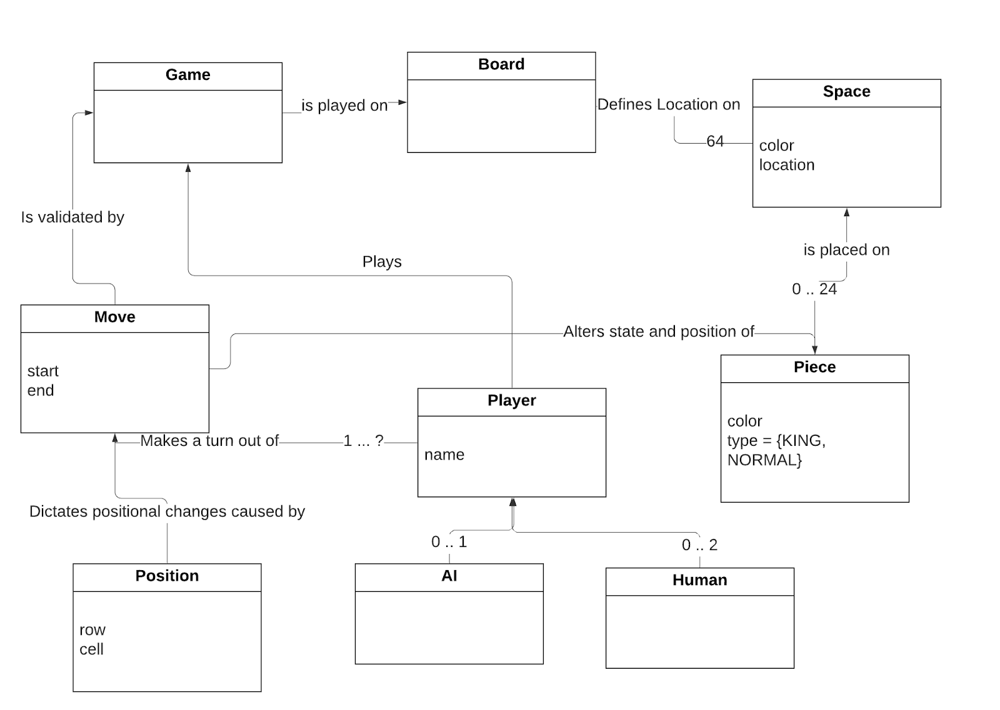
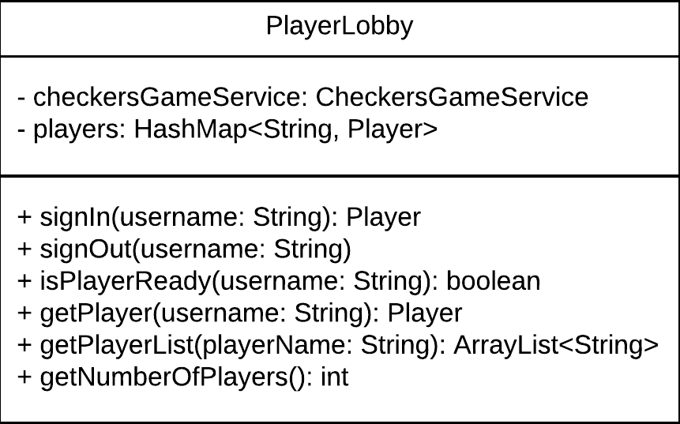
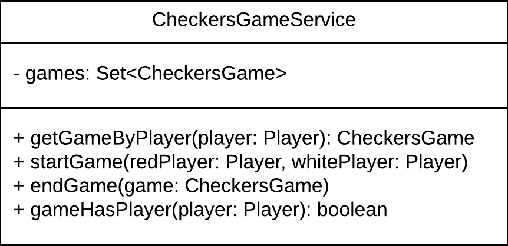

# PROJECT Design Documentation

## Team Information
* Team name: 07b-BluePolarBears
* Team members
  * Matthew DellaNeve
  * Michael Driscoll
  * Dade Wood
  * Zeb Hollinger
  * Nicholas Antiochos

## Executive Summary

This is a summary of the project.

### Purpose

The goal of WebCheckers is to allow players with internet to sign 
in and play Checkers with other players who are signed in. Players
can play Checkers by the American rules either with a real person
or an AI. Players can ask for help when it's their turn, and they may
resign from a game. Finally, players may sign out from the application
when they are finished. 

### Glossary and Acronyms

| Term | Definition |
|------|------------|
| VO | Value Object |
| UI | User Interface |
| MVP | Minimum Viable Product |
| AC | Acceptance Criteria |

## Requirements
The major requirements for the Checkers Webapp include:
* A home page that displays a button to let the user sign in
* The user must provide a valid alphanumeric username to sign in, or else they will be asked to provide a different username.
* The home page will display a list of active users when the current user signs in, and display a means to sign out
* The current user will be able to start a game of checkers by selecting a player on the home screen
* The two players will be able to play a full game of checkers until the game is won or lost
* The game will adhere to the standard set of American Rules
* The players may resign to end the game at any time

### Definition of MVP
The Minimum Viable Product has the following features:
1. Every player must sign-in before playing a game, and be able to sign-out when finished playing.
2. Two players must be able to play a game of checkers based upon the American rules.
3. Either player of a game may choose to resign, at any point, which ends the game.

### MVP Features

#### Epics
- As a Player I want to take my turn so that I can continue the checkers game and move a piece.
- As a Game I want to be able to end so that I am not immortal.

#### User Stories
- As a Player I want to sign-in so that I can play a game of checkers.
- As a Player I would like to sign out so that I can stop playing checkers.
- As a Player I would like to make a simple move so that I can move a piece closer to the 
opposite end of the board and keep playing.
- As a Player I would like to make a jump move so that I can capture an enemy piece and move 
further on the board.
- As a Player I would like to move a piece to the opposite end of the board so that I can king 
my piece and move it forwards and backwards.
- As a Player I want to capture all of the opponents checkers so that I can win the game.
- As a player I would like to be able to resign so that I can lose the game stop playing checkers.

### Roadmap of Enhancements
1. Sign-in page
2. Home page listing all available players
3. Selecting a player to start a game and see the game board
4. Player making a simple or jump move during their turn
5. Player submitting their turn
6. Player redoing the move they just made
7. Player winning or losing a game
8. Player resigning from a game
9. Player signing out from the application
10. Player can king their piece when they get a piece to the opposite end of the board
11. Game can end when a player has no more valid moves
12. Player can select and play with an AI 

## Application Domain
The application embodies a game of two players playing a game of checkers.
Two players play a game which is played on a board. That board holds 64 spaces, each
with a color (black or white) and a location on the board. If a player asks for help, then
a space is either highlighted or not. Pieces are placed on these spaces, and each piece has
a color (red or white), an id, and it can either be a normal or king piece. The player takes 
their turn by making a move, and a move contains a starting and ending position on the board. 
The game validates this move, and that move will update the position of a given piece. A player 
can select another player to play a game against, and that player could be a human or an AI player.

## Architecture and Design

This section describes the application architecture.

### Summary

The following Tiers/Layers model shows a high-level view of the webapp's architecture.

As a web application, the user interacts with the system using a
browser.  The client-side of the UI is composed of HTML pages with
some minimal CSS for styling the page.  There is also some JavaScript
that has been provided to the team by the architect.

The server-side tiers include the UI Tier that is composed of UI Controllers and Views.
Controllers are built using the Spark framework and View are built using the FreeMarker framework.  The Application and Model tiers are built using plain-old Java objects (POJOs).

Details of the components within these tiers are supplied below.

### Overview of User Interface

Upon startup of a web browser, the user will enter the URL to receive a render of the current home
page. The user will then be required to signin to be able to play a game of checkers.
When the signin button is clicked, the GetSignIn route will be called and the
user will be shown the sign in screen. After entering a valid name and pressing enter. That will
then call the PostSignIn route and render the home page, finally showing the players who
are available to play a game with. There is also a button labeled "AI" which allows the player to start
a game with an AI player. Then when the AI button or a player's name is clicked, the user who started the game
will call the PostHomeRoute to start the game. GetGameRoute will then render the game page for both users.
The player whose turn it is can make a move, and PostValidateMove will ensure that move is valid. The user
can back up the last move they made which will cause PostBackupMoveRoute to reset the piece's position. When 
the player submits their turn, PostSubmitTurnRoute ensures that the turn as a whole is valid and then switches
whose turn it is. While the user waits for the other player to take their turn, PostCheckTurnRoute activates
every 5 seconds to check if the player is still waiting or if it is now their turn. At any time, the user
can resign, which causes PostResignGameRoute to end the game and send the resigning user back to the home page.
When a user is done using the application, they may sign out, which triggers PostSignOutRoute to remove them
from the list of available players.

### UI Tier
This tier contains two types of components: Route Components and the `WebServer` component.
The Route Components are responsible for handling GET and POST requests at specific url routes,
and the `WebServer` component initializes these Route Components. The state diagram of this tier
is provided above in **Overview of User Interface**.

On startup within the UI tier, we visit the `WebServer` component. Here, we initialize our route
components as well as the strings for our routes, like "/" or "/signin".

The user first sends a request for GET "/", which sends the program to `GetHomeRoute`.
Since the user is not signed in, this route renders the home page with a welcome message
and the number of players waiting to play a game. After the user signs in, the route is called
again, and the user now sees their username on the navigation bar as well as an option to
log out. They also see a list of all the players available for starting a game instead of
just the number of players. If the user tries to select a player who is already in a game or 
who has already signed out, this route is called, and an error will display instead of the welcome 
message. If the user tries to go to the home page while in a game, this route will automatically 
redirect back to the game.

When a user selects the option to sign in from the home page and send a GET "/signin" request, 
`GetSignInRoute` is called. This route simply renders the sign-in page and directs the user
to "/signin". If the user tries to access this page while already signed in, this route automatically 
redirects back to the home page. 

At the sign-in page, the user can enter their desired username. They can then submit it through
a POST "/signin" request, which triggers the `PostSignInRoute`. This route makes sure the
given username is valid (must contain at least one alphanumeric character and no special characters).
When the user submits a valid username, the route will add them to the `PlayerLobby` and redirect
them back to the home page. If the username is invalid or already taken, the route will render an
error message and remain on the sign-in page until the user has entered a valid username.

From the home page, a user can select a player to start a game with. This will send a POST "/"
request and trigger the `PostHomeRoute`. The route keeps track of the player who requested the game
and the player who was selected for game. If both players are in the lobby, then a new game
is created, the players will join the game, and they are redirected to the game page. These steps are
similar if a player chooses the AI. If one of the players is null when a game tries to start, this means 
that one of the players has already joined a game, and the route will redirect the current user back to the 
home page. 

Once a game starts, the user also sends a GET "/game" request, which triggers the `GetGameRoute`.
This route renders the game page, which includes the board the game is played on. The route stores
pertinent information, like who the red and white players are and whose turn it is. From there, a game
of checkers will be played. If the game has ended via all of a player's pieces being captured, then this 
route renders the end-of-game messages to each player, like "you won/lost" or "the other player has resigned".
If the game has ended due to a player not being able to make any valid moves, then the game will state that
"player x has no more valid moves. Player y wins".

In the game, the user whose turn it is can move one of their pieces. When they do this, the client sends
a POST "/validateMove" request which triggers `PostValidateMoveRoute` to make sure the move the
player made was valid. If the move is a valid simple move or jump move, then the piece moves, and
the UI renders a message stating that the move was accepted. Otherwise, the UI renders an error
message, the piece moves back, and the player can try another move. 

The user may also back up their last turn they made. By pressing the _backup_ button, the `PostBackupMoveRoute`
is triggered. The last move is obtained, and the piece is placed back in its original position. 

If the player is waiting for the other user to take their turn, the game will refresh every 5 seconds and activate
`PostCheckTurnRoute` to see whose turn it is. This continues until the `CheckersGame`'s active color is the same
as the waiting player, where it then becomes that player's turn. If the game is over, either by a win/loss or
the other player resigning, this route sends an ajax message conveying information about the game's end.

At any time, either player may decide to resign. Once they hit the _resign_ button, the `PostResignGameRoute`
is called, which removes this player from the game and returns them to the home page. 

Once a player finishes using the application, assuming they are signed in, they can click the _sign-out_ button
to sign out from the application. This triggers `PostSignOutRoute` to remove the player from the `PlayerLobby`
so they are no longer visible as an available player. If the player signs out while in a game, then they are
also force resigned from the game.

### Application Tier
The Application Tier contains components that handle the business logic of the application. These
components help direct communication between Model components and Route components.

The `PlayerLobby` component coordinates the list of players signed in to the application. As a user
first opens the application, this component provides the number of players currently signed in for
the home page. When a user signs in, this component checks that the given username is valid or
available and creates a new `Player` for this user if these conditions are true. That `Player` is
then added to the list of all signed in players. The user returns to the home page, and `PlayerLobby` 
now provides the full list of players who are signed in. When the user selects a player to start a
game with, this component will retrieve the selected player and check if they are in a game or not.
The player is not retrieved if they are already in a game, and this signals to the application that a
game should not be started. Otherwise, a game is created and started.

_The Player Lobby UML Diagram_

The `CheckersGameService` component coordinates the set of all games currently active. When a user selects
another player to start a game, this component evaluates whether the selected player is in a game or not
and conveys that information accordingly. This is also done when a user attempts to access the home page,
since users currently in a game are not allowed to do this. When both players are available to start a game,
the `CheckersGameService` creates a new `CheckersGame` and adds it to the set of active games. When the current
user accesses the game page, this component finds this users game so that it can be displayed. Once the game
finishes, the service removes the game from the set of active games.

There is also an option for the player to start the game with an AI. To accomplish this, we created another method
to start the game with only one player, so the other player will be the AI. The AI will play like a normal player would
and follows all the rules until the game finishes.

_The CheckersGameService UML Diagram_

### Model Tier
The Model Tier contains two types of components: domain members and iterators. The domain members represent
real concepts within the domain of this application. The iterators are tools that allow for the application
to correctly display the board for each player in a game of checkers.

When a user attempts to sign in, the `Player` class validates the given username. Once successfully signed in,
an actual `Player` object is created to store the user's username. When a user joins a game, this `Player`
object is assigned to a `CheckersGame`.

A `CheckersGame` object represents a single active game of checkers. When a user selects an available opponent,
one of these objects is created. This domain member keeps track of what `Player`s are red and white as well as
whose turn it is. When the game page is rendered, this component provides the board that will be rendered for
the user. It also keeps track of the moves of the player whose turn it is so that a user can easily
back up a move.

The `BoardView` represents the overall state of the board. When the game page is rendered, this `BoardView`
maintains the location of pieces so that the correct state is presented to each player. Since each player
needs to see their own pieces at the bottom of the board, the `BoardView` also flips the board so that
the white player gets the correct board orientation.

The `Row` represents one row on the board. The `BoardView` contains all 8 `Row` objects. When the game page
is rendered, the `Row` provides information about the state of each `Space` in that `Row` so that it can 
be displayed properly. Since each player needs to see their pieces at the bottom of the board, a `Row`
reverses the order of its `Space`s for the white player as if that `Row` was flipped around.

A `Space` keeps track of the state of one specific cell on the board. It provides information about its index
on the board, if its valid (white spaces can contain pieces, black spaces cannot), and what `Piece` it contains.
When the game page is rendered, this information is conveyed to the UI, and the actual space on the board is
rendered.

A `Piece` represents a literal game piece on the board. A `Piece` can be standard or king and red or white.

Since a `BoardView` is a 2d array of elements, the UI needs a way to iterate over each element and display it
on a user's screen. The `BoardIterator` provides this functionality. It can iterate over each `Row` of the board
so that the UI can display its contents. However, it is not enough for the UI to be able to display each `Row`.
It needs to display each `Space` and its contents. The `SpaceIterator` provides this functionality. For a given
`Row`, it can iterate over each `Space` so that the UI can display its contents.

During a game, the user whose turn it is makes a move, and the UI creates a `Move`, which holds the starting and
ending `Position`. A `Position` then holds the row and space of the moving piece. Both of these objects help
verify that the move the user makes is valid.

During a game, the user must make valid moves and submit valid turns as a whole. The `TurnUtil` component
contains the logic that ensure that this is the case. When the user moves a piece, this component will
determine if the move the player made was a valid move, either a simple one-space diagonal move or a
jump over another piece. The component then also checks to see if the turn as a whole was valid. The user
cannot take a simple move if they have an available jump move, and if there is a jump move with multiple
jumps, the player must take every jump. This component also handles whether the player has any valid
moves they can make before they take their turn. This helps determine if the game should end.

The `AITurn` component controls the moves that the AI makes when a player plays a game with one. The AI
can determine if it has any valid moves, and it will make the first available valid move. AI didn't
get trained at AI school though, so it's not very smart and will not make the most optimal move.

_The UML representation of the Model tier_

### Design Improvements

#### Board Orientation
If we had more time, we would go back and update how the correct orientation of the board is shown for each
player (the player sees their own pieces on the bottom of the screen). This is something we had trouble with,
but we were able to come up with a solution where we create a copy of a game's `BoardView` with all its rows
and spaces reversed. However, creating a copy of the board each time the game updates is costly in terms of
time. This could be improved by formulating a way to have the iterators iterate over the board differently
depending on what color the current player is.

#### Adherence to the Law of Demeter
Towards the end of production, we started to get lazy with following the Law of Demeter. We had many chains
of function calls where a class like TurnUtil would reach all the way through CheckersGame, Board, Row, and
Space to get one Piece. We fixed most of these issues, but we still have significant Law of Demeter violations
that, if we had more time, we would come back and fix them.

#### CheckersGame
The `CheckersGame` class initially contained some useful information about managing a game of checkers, but
it quickly got out of hand and performs way too much of the game's functionality. If we had more time, we
would give it more of a well-defined job instead of having do many tasks all at once.

#### TurnUtil
Our `TurnUtil` class could have been cleaner in regard to move and turn validation logic. If we had more
time, we could have simplified it to make it easier to understand. We also could have broken up some of
those functions for readability.

## Testing

### Acceptance Testing

49/49 User Stories passed Acceptance Testing
  
0/49 Stories have yet to be tested
  

### Unit Testing and Code Coverage

#### Unit Testing Strategy
For any given story, the unit tests for its components will be written once the story's solution tasks are
completed. This helps us verify that our code is working and ensures that the story is closer to completing
its AC.

Unit tests themselves should cover all critical parts of a component. If some code has multiple case branches,
all of those branches should be accounted for

#### Code Coverage Targets
Components that are used as friendlies in other unit tests should be 100% covered since it is critical that
the entire component works when we test another component.

All other components should have around 80% coverage. Since our components do not get overly complex, it
is reasonable to believe that we can test most, if not all, of a component. A few components have been
harder to test than others, but we have been pretty consistent in meeting our goals.

#### Code Coverage Report
UI Tier: 81% covered
Application Tier: 85% covered
Model Tier: 92% covered
